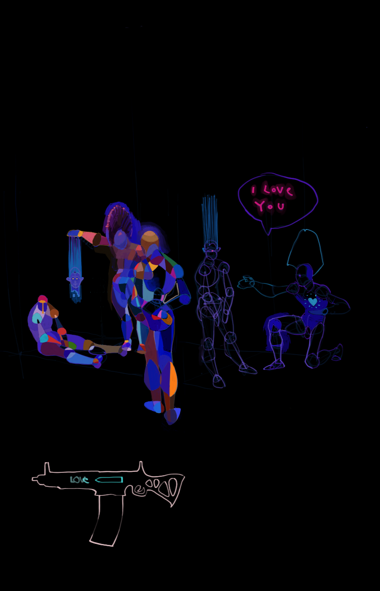
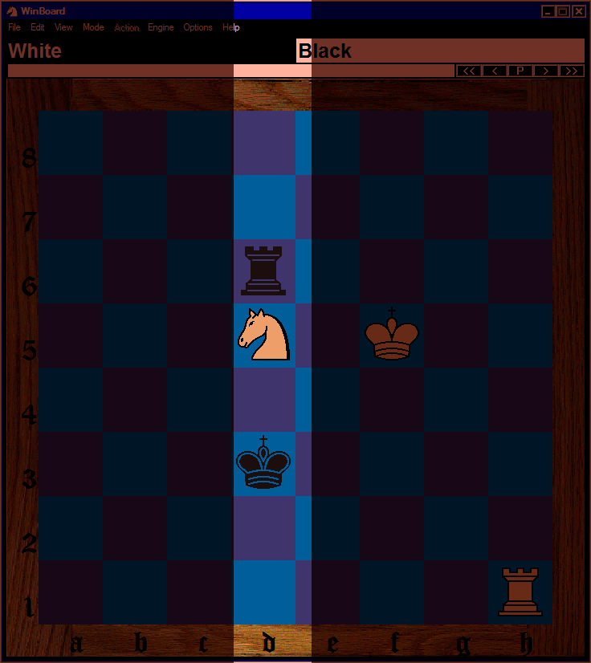

# The Readme
***First*** two problems [a] relatively easy **dfs** typeof (problems),
but I didn't find a _not_so_complicated_ solution [4] the 3rd problem.
*'94* is a historical year for *Bulgarian* football, we became *4th*
in the **World**, and I can give you *guarantee* this won't happen again:),
from this year *Solutions* (aka SPOILERS) are given on the site
as well [clck](https://ioinformatics.org/page/ioi-1994/20).

Anyway, by trying to solve *The Primes* problem I think I've figured what
***BackTracking*** is; it's like a brute force *recursive* **for** *loof*
*typeof(*thing*)*. [4] example we can write *5* **for** loofs like this:

```Python
for i in range(10):
    for j in range(10):
        for k in range(10):
            for l in range(10):
                for m in range(10):
                     print("c7aBu r7ynaKa")
```

,but what if we want arbitrary ***n*** loopz?, than we can use recursive calls.
The program make use of **Python's** *dictionaries* with ***tuple*** keys,
that is ***hash*** tables, for fast lookups, theoretically it works with any
number of digits, although with *6* digits it starts running forever. Here is
the only solution with *4* digits, with ***sqr[*** *0* ***][*** *0* ***]***
equals to *1* and digits sum equals to *14*:

```
[1, 1, 9, 3]
[9, 2, 2, 1]
[3, 8, 2, 1]
[1, 3, 1, 9]
```

Running times for *5* digits are reasonable; the text example is found
almost instantly, and one of the most lengthy scenarios: ``./ThePrimes.py 1 23``
dumps *88* solutions for about **5** *minutes*. Here are the first and the
last ones:

```
[1, 9, 4, 6, 3]
[5, 0, 3, 8, 7]
[9, 2, 8, 3, 1]
[7, 3, 5, 5, 3]
[1, 9, 3, 1, 9]
...

[1, 8, 3, 2, 9]
[7, 9, 1, 3, 3]
[4, 3, 8, 5, 3]
[8, 0, 4, 4, 7]
[3, 3, 7, 9, 1]
```



The second problem **(The Castle)** is written in *JavaScript*, and the input
seems like an issue without **NodeJS**, but it's quite fun to use the browser
as a debugger. Here is some console screenshot:


[( Zen Meditation Music )](https://youtu.be/WZKW2Hq2fks)